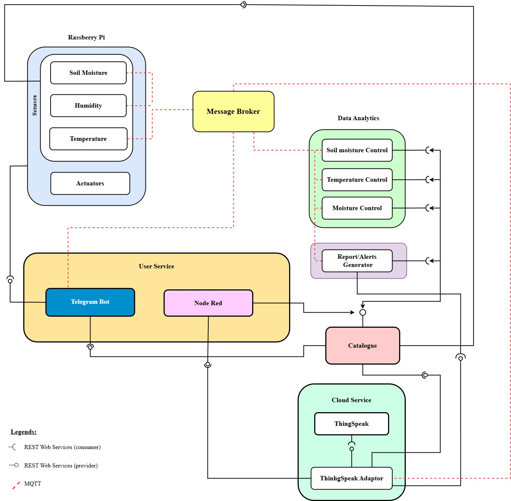

# Smart Plant Care System (SPCS)

## Overview

Smart Plant Care System (SPCS) is a microservices-based IoT platform for monitoring and automatically caring for plants. It features simulated or real sensor data, automated watering, alert notifications, a web dashboard, and a Telegram bot for user interaction. The system is fully containerized using Docker Compose.


## Quick Start

1. **Configuration:** Copy `.env.example` to `.env` and update values:
   - Generate a secure InfluxDB token and set `INFLUXDB_ADMIN_TOKEN`.
   - Provide your Telegram bot token and your Telegram numeric chat ID in `TELEGRAM_BOT_TOKEN` and `ALLOWED_CHAT_IDS`.
   - (For real sensor mode on Raspberry Pi, set `MODE=real` and configure `DHT_PIN` etc.)

2. **Build and Run:** Ensure Docker and Docker Compose are installed. Then run:
   ```bash
   docker compose up -d --build

3. **Access the Dashboard:** Open your browser and go to `http://127.0.0.1:1880/ui` to access the Node-RED dashboard.
